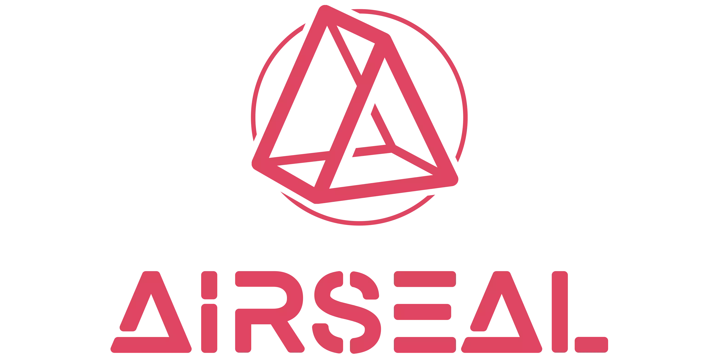

## About Project

The website https://airseal.in/ was crafted using Laravel 9, serving as a static website meticulously designed and developed within a month to align with the specific requirements of the client. This project involved integrating external designs and effects to elevate the user experience. Additionally, an admin panel was implemented to facilitate the seamless uploading of blogs, enhancing the website's dynamic content and interactivity.

For further exploration of Air Seal's offerings and services, feel free to visit their website at airseal.in.

## Website video

https://github.com/princeidot/airsel/assets/131530732/6a8a500d-27fe-4b2d-a975-24e81444ae29

